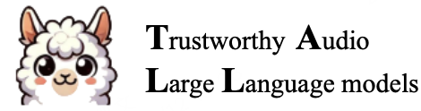

# 🎧 Awesome Trustworthy Audio-LLMs  

  

*A curated and continuously evolving collection of research papers, benchmarks, datasets, and open resources on Trustworthy Audio Large Language Models, covering the full spectrum of safety, robustness, and reliability in audio large models. The collection also includes representative works on audio large models beyond the safety domain.*

---
## 🌍Introduction  

With the rapid developmenst of **Audio Large Language Models (Audio-LLMs)**, ensuring their **trustworthiness and safety** has become an essential research frontier.  

This repository(TALLM) serves as a **comprehensive and community-driven hub** for tracking progress in the field of **trustworthy audio intelligence**. 

It highlights research on:
- 🛡️ **Safety**
- ⚖️ **Fairness**  
- 🔮 **Hallucination** 
- 🔐 **Privacy** 
- ⚙️ **Robustness**
- 💡 **Interpretability**
- 💻 **Security**
- ...

Together, these works aim toward a future where Audio-LLMs are **not only capable of understanding voices — but also worthy of being trusted**.

---

## 📌 Table of Content

- [🧭 Research Collections](#-research-collections)
- [🎒Good Papers](#-good-papers)
- [🗞️ Recent News](#-recent-news)
- [🤝 How to Contribute](#-how-to-contribute)
- [💬 LLM Safety Discussion](#-llm-safety-discussion)
- [🌟 Rising Stars](#-rising-stars)
- [🙏Acknowledgement](#-acknowledgement)

---

## 🧭 Research Collections 
  
- Paper
   - A. Safety
      - [📖A1. General](./papers/safety/general.md)
      - [✏️A2. Jailbreak](./papers/safety/jailbreak.md)
      - [🏫A3. Alignment](./papers/safety/alignment.md)
      - [📚A4. Deepfake](./papers/safety/deepfake.md)
      - [🎒A5. Prompt Injection](./papers/safety/prompt_injection.md)
      - [🧑‍🏫A6. Defense](./papers/safety/defense.md)
      - [🧑‍🎓A7. Fairness](./papers/safety/fairness.md)
  - B. Security
      - [📖B1. General](./papers/security/general.md)
      - [✏️B2. Adversarial Examples](./papers/security/adversarial_examples.md)
      - [🏫B3. Attack](./papers/security/attack.md)
      - [📚B4. Poison & Backdoor](./papers/security/poison_and_backdoor.md)
  - C. Privacy
      - [📖C1. General](./papers/privacy/general.md)
  - D. Interpretability
      - [📖D1. General](./papers/interpretability/general.md)
  - E. Fairness
      - [📖E1. General](./papers/fairness/general.md)
  - F Hallucination
      - [📖F1. General](./papers/hallucination/general.md)
  - G Robustness
      - [📖G1.General](./papers/robustness/general.md)

### In addition to the above-mentioned ones:
If you want to learn more about Audio Large Language Models, you can take a look at the following.
  - 🚀 [Survey](collections/survey.md)
  - 🚀 [Technical Report for Audio Large Language Models](collections/technical_report.md)
  - 🚀 [Toolkit](collections/toolkit.md)
  - 🚀 [Benchmark](collections/benchmark.md)
  - 🚀 [Capability](collections/capability.md)

---

## 🎒 Good Papers
- 🏆 [Attacker's Noise Can Manipulate Your Audio-based LLM in the Real World](https://arxiv.org/abs/2507.06256)
- 🏆 [Speech-Audio Compositional Attacks on Multimodal LLMs and Their Mitigation with SALMONN-Guard](https://arxiv.org/abs/2511.10222)
- 🏆 [AHa-Bench: Benchmarking Audio Hallucinations in Large Audio-Language Models](https://openreview.net/forum?id=vCej5sO61x)
- 🏆 [Hidden in the Noise: Unveiling Backdoors in Audio LLMs Alignment through Latent Acoustic Pattern Triggers](https://arxiv.org/abs/2508.02175v3)

---
## 🗞️ Recent News  
- **[2025.11.12]** 🐣TALLM is released!!!
- **[2025.11.25]** ⛰️Version1 is open to everyone!!!
- **[2025.11.26]** 🍠TALLM has posted on xhs!!!
- **[2025.12.01]** 📈General capabilities have been collected!!!

---

## 🤝 How to Contribute  

*We welcome contributions from researchers and practitioners!  If you'd like to submit a piece of writing, please write an email to **kaiwenluo74@gmail.com** or write your paper link in **issues part**. Then we can add the article in.*

---

## 💬 LLM Safety Discussion

[Wechat Group](./resource/wechat2.jpg) 

[Discord Group: TALLM](./resource/discord.md)

---

## 🌟 Rising Stars

---

## 🙏 Acknowledgement

- Organizers: [Kevin Luo (罗凯文)](https://scholar.google.com/citations?user=XnZXByMAAAAJ&hl=en), [Zhenhong Zhou(周振宏)](https://ydyjya.github.io), [Liang Lin (林亮)](https://scholar.google.com/citations?user=XQNpChIAAAAJ&hl=en)

  

